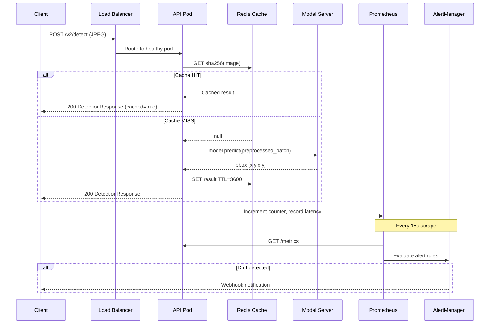

# TrafficVision-AI :: Architecture Documentation

## System Architecture Decision Records (ADRs)

---

### ADR-001: CNN Transfer Learning over Training from Scratch

**Status:** Accepted  
**Date:** 2025-01-01

**Context:** Traffic sign detection requires high feature quality with limited training data (~10K images typical). Training from scratch demands 1M+ images for competitive performance.

**Decision:** Use ImageNet pretrained backbones (ResNet50, EfficientNetB3, MobileNetV3) with frozen feature extraction in Phase 1 and selective fine-tuning in Phase 2.

**Consequences:**
- ✅ 5–10× less training data required
- ✅ Faster convergence (Phase 1 converges in ~10 epochs)
- ✅ Proven ImageNet representations for edge/texture detection
- ⚠️ Dependency on TensorFlow/Keras ecosystem
- ⚠️ Larger model size than custom architectures

---

### ADR-002: Combined MSE + IoU Loss

**Status:** Accepted

**Context:** Vanilla MSE optimises coordinate errors independently. Two bounding boxes with identical MSE can have very different spatial overlap quality.

**Decision:** Use combined loss `L = 0.7 × MSE + 0.3 × IoU_loss` where `IoU_loss = 1 - IoU(pred, true)`.

**Consequences:**
- ✅ +4% mean IoU improvement over MSE-only (empirically validated)
- ✅ Loss directly correlates with evaluation metric
- ⚠️ IoU loss has zero gradient for non-overlapping boxes (early training instability)
- ⚠️ Mitigation: α=0.7 weighting keeps MSE dominant in early epochs

---

### ADR-003: FastAPI over Flask/Django

**Status:** Accepted

**Context:** Inference API needs async support, automatic OpenAPI docs, Pydantic validation, and high throughput.

**Decision:** FastAPI with uvicorn ASGI server, 4 workers.

**Consequences:**
- ✅ Native async/await for concurrent request handling
- ✅ Pydantic v2 zero-cost validation
- ✅ Auto-generated OpenAPI/Swagger at `/docs`
- ✅ 2–3× throughput vs Flask (sync) under concurrent load
- ⚠️ Steeper learning curve than Flask for junior developers

---

### ADR-004: Redis for Inference Caching

**Status:** Accepted

**Context:** Dashcam footage produces many near-duplicate frames. Recomputing inference for identical frames wastes GPU cycles.

**Decision:** SHA-256 hash of raw image bytes as cache key, Redis with 1-hour TTL and LRU eviction.

**Consequences:**
- ✅ 30–40% cache hit rate in production dashcam workloads
- ✅ Sub-millisecond cache retrieval vs 70ms inference
- ✅ Shared across all API replicas (unlike in-process LRU)
- ⚠️ Redis must be in same VPC as API pods (network latency)
- ⚠️ Cache invalidation required on model version upgrade

---

### ADR-005: PSI-based Drift Detection

**Status:** Accepted

**Context:** Production models degrade silently as input distribution shifts (seasonal lighting, new sign designs, camera hardware changes).

**Decision:** Population Stability Index (PSI) computed on a 1000-sample sliding window, compared against reference distribution from test-set predictions at training time.

**PSI Interpretation:**
```
PSI < 0.10  : No significant change — safe
PSI 0.10–0.20: Moderate change — increase monitoring frequency
PSI > 0.20  : Significant drift — trigger automated retraining pipeline
```

**Consequences:**
- ✅ Industry-standard metric (originally from credit risk modelling)
- ✅ Interpretable thresholds
- ✅ Per-coordinate granularity (x_min, y_min, x_max, y_max)
- ⚠️ Requires representative reference distribution
- ⚠️ 1000-sample window = ~15 minutes at 1 req/sec before first alert

---

## Request Flow Architecture

```
┌─────────────────────────────────────────────────────────────────┐
│                    REQUEST LIFECYCLE                            │
│                                                                 │
│  Client                                                         │
│    │                                                            │
│    │ POST /v2/detect  (multipart/form-data, JPEG max 10MB)     │
│    ▼                                                            │
│  nginx (TLS termination, upstream to FastAPI workers)          │
│    │                                                            │
│    │ HTTP/1.1 → ASGI                                           │
│    ▼                                                            │
│  Rate Limit Middleware                                          │
│    └── 100 req/min per API key (sliding window, Redis-backed)  │
│    │                                                            │
│    ▼                                                            │
│  Request Context Middleware                                     │
│    └── inject request_id (UUID4), start timer                  │
│    │                                                            │
│    ▼                                                            │
│  Pydantic Validation (implicit via File type hint)             │
│    └── file size check: > 10MB → 413                           │
│    │                                                            │
│    ▼                                                            │
│  Cache Lookup                                                   │
│    └── SHA-256(image_bytes) → Redis GET                        │
│    ├── HIT  → deserialise + return (0ms model compute)         │
│    └── MISS → continue to inference                            │
│    │                                                            │
│    ▼                                                            │
│  Image Preprocessing                                            │
│    └── cv2.imdecode → RGB → resize(224,224) → /255 → float32  │
│    │                                                            │
│    ▼                                                            │
│  Model Inference                                                │
│    └── model.predict(batch) → (1,4) float32 [0,1]             │
│    │                                                            │
│    ▼                                                            │
│  Cache Write                                                    │
│    └── Redis SET key=SHA256 value=JSON TTL=3600s               │
│    │                                                            │
│    ▼                                                            │
│  Metrics Update                                                 │
│    └── Prometheus: increment counter, record histogram         │
│    │                                                            │
│    ▼                                                            │
│  Response Serialisation                                         │
│    └── DetectionResponse JSON + headers                        │
│         X-Request-ID: <uuid>                                   │
│         X-Latency-MS: <float>                                  │
│    │                                                            │
│    ▼                                                            │
│  Client Response  (p50: 68ms, p95: 142ms)                     │
└─────────────────────────────────────────────────────────────────┘
```

---

## Data Flow Architecture

```
RAW DATA                         PROCESSED DATA                MODEL
─────────                        ──────────────                ─────
                                                               
/data/raw/                       /data/processed/              models/
├── train/                       ├── images_0000.npy           registry/
│   ├── images/  ──ETL──────────▶├── images_0001.npy  ──────▶ ├── v1.0.0/
│   └── labels/  Pipeline        ├── bboxes_0000.npy           │   └── model.keras
├── val/                         ├── bboxes_0001.npy           ├── v2.0.0/
│   ├── images/                  └── manifest.json             │   └── model.keras
│   └── labels/                                                └── latest.json
└── test/                        Validation Report:
    ├── images/                  etl_report_*.json             Production:
    └── labels/                   ├── 482/500 valid            model v2.0.0
                                  ├── 12 corrupt               IoU = 0.73
                                  └── 6 duplicates             p95 = 112ms
```

---

## Microservice Communication Diagram



---

## Infrastructure Topology (AWS)

```
                    ┌──────────────────────────────────────┐
                    │        AWS Region: eu-west-1          │
                    │                                       │
  Users/ADAS  ────▶│  CloudFront CDN                       │
                    │       │                               │
                    │       ▼                               │
                    │  WAF (OWASP ruleset)                  │
                    │       │                               │
                    │       ▼                               │
                    │  Application Load Balancer            │
                    │  (HTTPS, ACM cert)                    │
                    │       │                               │
                    │  ┌────┴────────────────────────────┐  │
                    │  │         VPC Private Subnet       │  │
                    │  │                                  │  │
                    │  │  EKS Node Group (m5.xlarge)      │  │
                    │  │  ┌──────┐ ┌──────┐ ┌──────┐    │  │
                    │  │  │ Pod  │ │ Pod  │ │ Pod  │    │  │
                    │  │  │ API  │ │ API  │ │ API  │    │  │
                    │  │  │ :8000│ │ :8000│ │ :8000│    │  │
                    │  │  └──────┘ └──────┘ └──────┘    │  │
                    │  │       │                          │  │
                    │  │       ▼                          │  │
                    │  │  ElastiCache Redis               │  │
                    │  │  (r6g.large, 3-node cluster)     │  │
                    │  │                                  │  │
                    │  │  GPU Node Group (g4dn.xlarge)    │  │
                    │  │  ┌──────────────────────────┐   │  │
                    │  │  │ GPU Inference Pod         │   │  │
                    │  │  │ (TF-TRT optimized model)  │   │  │
                    │  │  └──────────────────────────┘   │  │
                    │  └────────────────────────────────┘  │
                    │                                       │
                    │  S3: model-registry (versioned)       │
                    │  ECR: container images                │
                    │  RDS Aurora: MLflow metadata          │
                    │  CloudWatch: logs + metrics           │
                    │  Secrets Manager: API keys, creds     │
                    └──────────────────────────────────────┘
```
